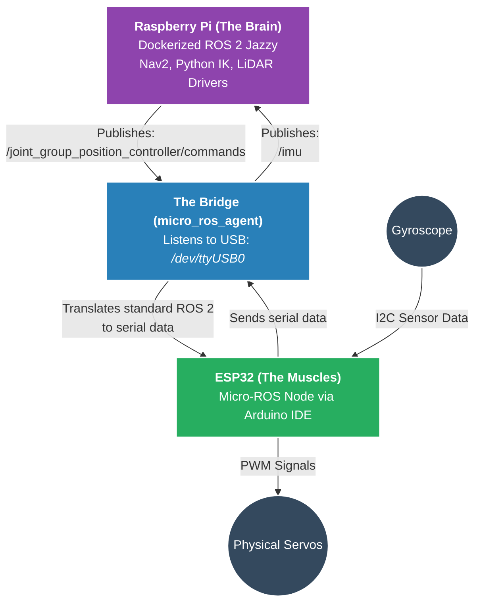

## Building the physical robot
Time to put the hardware together! Moving from simulation to a physical quadruped requires strict attention to power distribution and data bus management.

## Critical assembly rules
* **Power isolation:** Servos draw massive spikes of current when lifting the robot. Power your Raspberry Pi from one UBEC, and your 8 servos from a second 6A UBEC. Don't try to pull servo power through the Pi or the ESP32.
* **Common ground:** This is the most frequent hardware bug. You MUST tie the ground wire of your ESP32 to the ground wire of your Servo UBEC. If you don't, the PWM signals will float and your servos will twitch violently.
* **The I2C bus:** Connect your IMU to the ESP32 using pins 21 (SDA) and 22 (SCL). Reserve these communication lanes exclusively for the sensor.
* **LiDAR data:** Plug the LD19 LiDAR directly into one of the Raspberry Pi's USB ports (usually mounting as `/dev/ttyUSB1`).

<details>
<summary>Click to view the link betwee esp and raspberry</summary>


</details>

---

## Roadblocks & solutions: hardware quirks
Physics doesn't care about your code. Here is the main electrical hurdle I had to overcome during the build.

> [!TIP]
> **Install physical switches!**. Simple on/off toggle between your battery and your raspberry pi so that you don't need to constantly plug your battery.

### Link between esp and your PC

1) For now you will plug your esp32 to your pc but I had a lot of issue whith that. So when you plug for the first time your esp try to connect in an empty container:  

```
sudo docker run -it --rm -v /dev:/dev --privileged --net=host microros/micro-ros-agent:jazzy serial --dev /dev/ttyUSB0 -v6
```
2) If it doesn't connect try to press the `EN` / `RST` button you your esp.<br>
3) Some times the instance of microros wasn't killed properly so you have to check if there are there multiple instance of `micro_ros_agent` ?  
```
sudo fuser -v /dev/ttyUSB0 && sudo pkill -9 micro_ros_agent  
```
4) If it still doesn't work becarfull that your usb cable support data transmission (often cheap cables don't work).
5) And last be not least be sure that your esp is on `/dev/ttyUSB0`.

### The 4.43V servo brownout
**The problem:** Despite using a 5V/6V 3A adjustable UBEC to power the servos, a multimeter showed the output maxing out at exactly 4.43V. The servos lacked the torque to lift the robot's body.<br>
**The fix:** A UBEC is a step-down (buck) converter it has a physical "dropout voltage" of around 0.6V and requires an input voltage strictly higher than its target output. Feeding 5V will mathematically results in a drop to ~4.4V. 
I solved this by supplying the UBEC directly from a LiPo battery.

And now the [real fun can beggin](https://github.com/joschmaCYU/quadruped/blob/main/RealRobotREADME.md)
