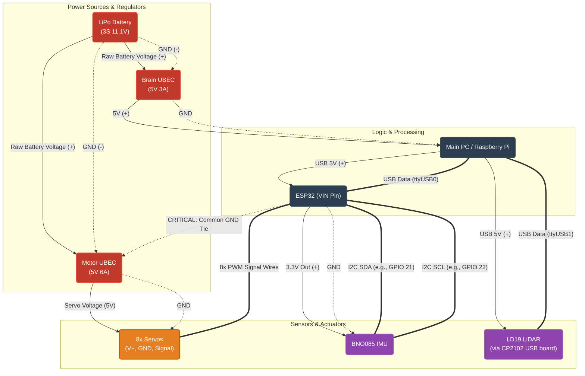

### 1 - Parts
As stated before we will be using ROS 2 but it needs power to run ! Thats why you will need something powerfull like a raspberry pi 5. To communicate with the servos and other actuators I choose an ESP32. You could plug everything but the rasp has only 4 PWM pins and you can't just plug the servos to any GPIO pins else they will not act as you want. 
To sens the world I choose a 2D lidar (for SLAM/Navigation). This will mesure how far away the obstacles are.

> [!TIP]
> You don't need to place the lidar low to the ground because you will be able to move your legs up, so even if the lidar doesn't detect the obstacle your robot will still be able to pass over it.

The power side is much more strait forward. If you want to move multiple servos at the same time your boards will not provide sufficiant power you will need a battery. I choose a small 2200mAh LiPo Battery. The servos need 5v to operate you need to make sure to provide these 5v to much and your servo will burn and to little they will not move. So you will need a 5V/6A UBEC which regulates the voltage and has a max current of 6A
> [!WARNING]
> If your servo use more then 6A be sure to take a more powerfull UBEC

And the rasp needs also 5V but will not pull more then 3A so I took a 5V/3A UBEC for it!

Sketch of my electronic:

> [!TIP]
> You can add some other sensors like: foot contact sensors, a depth camera, ToF sensors, power monitoring

With all of that in mind we can begging with [printing](https://github.com/joschmaCYU/quadruped#2---print--assemble)
