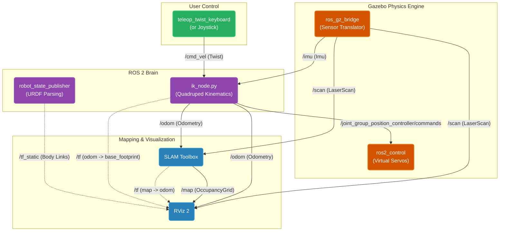
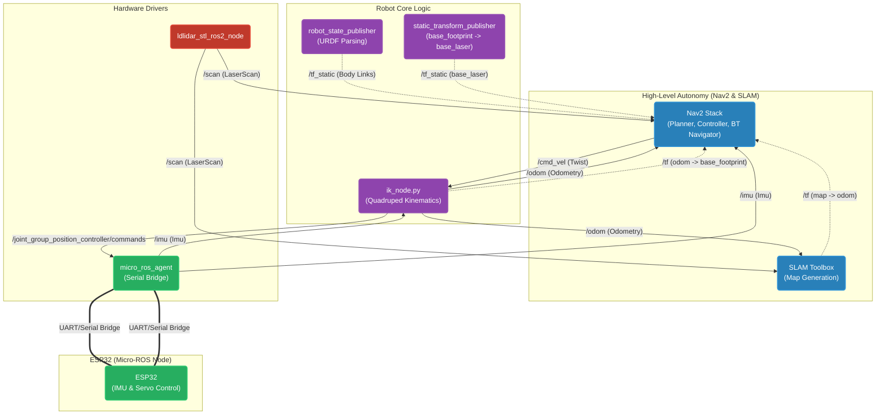

# YMA Quadruped ROS2

<br>

This repo is for my quadruped robot (code, 3D files, etc.). <br>
This walking robot can autonomously navigate thanks to Nav2 and SLAM. I built this with ROS 2 Jazzy, running on an ESP32 and a Raspberry Pi.<br>
My goal is to show examples of how to make your own autonomous quadruped with ROS 2.<br>
## What it can do
https://github.com/user-attachments/assets/2a4f5992-fd1c-4fa5-9b9c-b5832c5c24f9
## Why making a quadruped
The answer is easy! **To learn new stuff!**
<br>
I faced many challenges but I will guide you through everything. 

# Installation
```
cd ~/ros2_ws/src
git clone https://github.com/joschmaCYU/quadruped/
cd quadruped/docker
bash build.sh
```
# Usage
You can either use the GUI:
```
python3 src/quadruped_basics/dashboard.py
```
Or you can use the terminal
## For sim
```
ros2 launch quadruped sim.amcl.launch.py
```
or 
```
ros2 launch quadruped sim.slam.launch.py
```
## For the real robot
```
ros2 launch quadruped real.amcl.launch.py
```
or
```
ros2 launch quadruped real.slam.launch.py
```

# Tutorial -your turn to build (🚧 work in progress 🚧):
Follow these steps to build your own quadruped !

### 0 - What will my robot do ?
The first question you have to ask your self and the most important one is: *what will my robot do ?*<br>
For me, I want my robot to autonomously navigate a semi-controlled environement.

### 1 - Parts
Now that you have defined your goals you need to pick your parts.<br>
I choose:
- Compute: Raspberry Pi 4 (Main ROS 2 brain) and ESP32 (Servo controller)
- Actuators: 8x MG90S Micro Servos
- Sensors: 2D LiDAR (for SLAM/Navigation) and an IMU
> [!WARNING]
> You should really use an IMU else the odometry will be very difficult to work with

For more details see [parts](https://github.com/joschmaCYU/quadruped/blob/main/PartsREADME.md)

### 2 - Print & Assemble
Now that you know what we have to fit in our robot lets design it. Use your favorite CAD software and create your URDF file.<br>
For more help see [print](https://github.com/joschmaCYU/quadruped/blob/main/PrintREADME.md)

### 3 - Simulating the robot and let's use ROS
Now that you have your urdf file we can simulate it!<br>
The robot runs on ROS 2 Jazzy. It handles the communication between the sensors, actuators, the Pi, and the ESP32. <br> 
[Let's bring your robot to sim](https://github.com/joschmaCYU/quadruped/blob/main/SimREADME.md)<br>

#### Teleoperation
Now that you implemented everything to make the robot let's make it move!<br>
You will have to [launch gz-sim and run the urdf spawn script](https://gazebosim.org/docs/latest/spawn_urdf/)<br>
```ros2 run teleop_twist_keyboard teleop_twist_keyboard --ros-args -p use_sim_time:=true```
<br>
<details>
<summary>Click to view the summary of ros2 topics (for sim):</summary>
    


</details>
    
### 4 - Navigation
For this, we will need to use gz-sim (or the real robot) in combination with AMCL and SLAM. In the ROS 2 world, it’s not a battle of "SLAM vs. AMCL"—they work together as a team.
#### 4.1 - SLAM
What is it? SLAM is the process of a robot building a map of an unknown environment while simultaneously keeping track of its current location within that map.<br>
What is it used for? You use SLAM in "Explore" mode. You manually drive your quadruped around your room. The LiDAR scans the walls and draws a map. Once the map is complete, you save it as a static image file (.yaml) and turn SLAM off entirely.
```
ros2 run nav2_map_server map_saver_cli -f my_room_map
```
#### 4.2 - AMCL
Once you have a saved map, you switch to AMCL for day-to-day autonomous navigation. AMCL scatters a cloud of guesses (particles) on your map and uses the live LiDAR data to lock onto the robot's exact position.

[!TIP]
> AMCL is highly recommended for walking robots. Quadrupeds suffer from "foot slip" which causes the odometry to drift. If you run SLAM permanently, this slipping will slowly warp and duplicate your walls, corrupting your map. AMCL uses a locked, read-only map and simply corrects the robot's position against it, making navigation incredibly stable.
> So you should use SLAM in an unknown environment and use AMCL if your environment isn't changing

#### 4.3 - Config Files
Both AMCL (via Nav2) and SLAM require highly tuned parameters to work perfectly.
<br> You can either clone mine :
```
cd ~/ros2_ws/src/quadruped/config
wget https://github.com/joschmaCYU/quadruped/blob/main/src/quadruped_basics/config/my_slam_params.yaml
https://github.com/joschmaCYU/quadruped/blob/main/src/quadruped_basics/config/my_nav2.yaml
```
Or grab the default parameters.
```
cd ~/ros2_ws/src/quadruped/config
wget https://raw.githubusercontent.com/SteveMacenski/slam_toolbox/ros2/config/mapper_params_online_async.yaml -O my_slam_params.yaml
wget https://raw.githubusercontent.com/ros-navigation/navigation2/jazzy/nav2_bringup/params/nav2_params.yaml -O my_nav2.yaml
```

### 5 - Bulding the robot
Time to put the hardware together! Refer back to the wiring diagram in the Parts section, but keep these critical assembly rules in mind:
- Power Isolation: Servos draw massive spikes of current when lifting the robot. Power your Raspberry Pi from one UBEC, and your 8 servos from the second 6A UBEC. Never try to pull servo power through the Pi or the ESP32.
- Common Ground: This is the most frequent hardware bug. You MUST tie the ground wire of your ESP32 to the ground wire of your Servo UBEC. If you don't, the PWM signals will float and your servos will twitch violently.
- The I2C Bus: Connect your BNO085 IMU to the ESP32 using pins 21 (SDA) and 22 (SCL). Reserve these communication lanes exclusively for the sensor.
- LiDAR Data: Plug the LD19 LiDAR directly into one of the Raspberry Pi's USB ports (usually mounting as /dev/ttyUSB1).
### 6 - Sim to life
The magic of ROS 2 is that the "brain" (your Python kinematics and Nav2 planners) does not care if the robot is a Gazebo simulation or physical plastic. It just publishes to topics and waits for a response.<br>

To bridge the physical hardware to the ROS 2 network, we use Micro-ROS:
1) The ESP32 (The Muscles): We flash the ESP32 with our [code](https://github.com/joschmaCYU/quadruped/blob/main/arduino/ESP32_micro_ROS_quad_copy_20260317203803/ESP32_micro_ROS_quad_copy_20260317203803.ino). It acts as a lightweight ROS 2 node that subscribes to /joint_group_position_controller/commands (listening to the Python brain and moving the physical servos) and publishes /imu data at 50Hz directly from the I2C bus.
2) The Raspberry Pi (The Brain): The Pi handles the heavy logic: Nav2, Python Inverse Kinematics, and the LiDAR drivers. Because Gazebo is too heavy for a Pi, we use an architecture-aware Dockerfile that skips installing simulation tools on ARM devices, saving gigabytes of SD card space.
3) The Bridge: We run micro_ros_agent on the Pi. It actively listens to the USB serial port (/dev/ttyUSB0) connected to the ESP32 and seamlessly translates the microcontroller's raw serial data into standard ROS 2 topics.

If the robot doesn't start see FAQ<br>

Once the Micro-ROS agent connects, your physical robot is officially online and will execute the exact same walk cycles you perfected in the simulator. Use SLAM or AMCL or teleoperation to make it move!
<br>
<details>
<summary>Click to view the summary of our ros2 topics when running the real robot</summary>
    


</details>
details
<details>
<summary>FAQ</summary>
<details><summary>Why is my robot not walking</summary>
There could be multiple reasons. But I will help you.
1) My esp32 doesn't connect to micro ros.
Make sure to have your lidar pluged.
If it blinks kickly 7 times it can't connect to the IMU.
If it blinks 1 time it can't connect to ros. There could be multiple [solutions](https://github.com/joschmaCYU/quadruped/blob/main/docker/cheatsheet.md#if-robot-not-connecting-)
If it blinks very quickly multiple time per second are your servos getting power ?
</details>
<details><summary>Should I program in Python or C++ ?</summary>
At the start for quick iteration you can use python and if the performance requires it switch to c++. <br><br>
</details>
</details>
