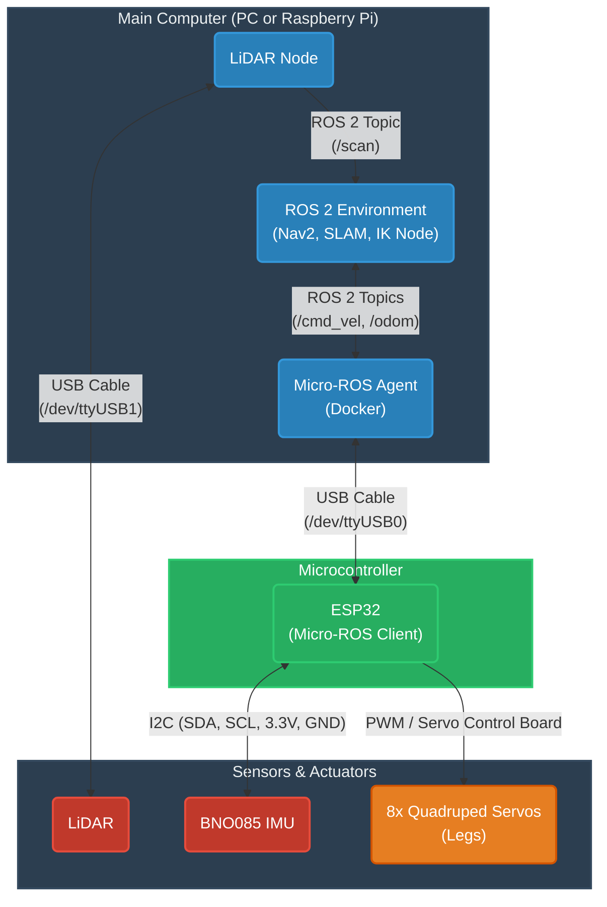

## Simulating the robot
Why sim? Because here we can test a lot of dumb stuff whithout breaking our real robot.

### What is ROS and what will we be using ROS for ?
The most simple explanation I can give is : ROS is like **whatsapp but for robot parts**. <br>
ROS alse benefits from a great echo system (simulators, autonomus navigation, mapping...).

> [!TIP]
> If you have never used ROS you should begging with getting familiar to it with [tutorials](https://docs.ros.org/en/jazzy/Tutorials.html)!

<details>
<summary>This is how it will work:</summary>



</details>

> [!TIP]
> We will use gz-sim for simulation but there are other alternatives (like Webots or Isaac Sim).

### Set up urdf & sim
You can find a tutorial to do so [here](https://github.com/MOGI-ROS/Week-3-4-Gazebo-basics). I will not detail this part which is outside of this tutorial scope.

## Making the robot move
To make the robot move we will use inverse kinematics.<br>
If you don't want to build this I am sure you can find some pre-built frameworks like `ros2_control` walking plugins to do the heavy lifting for you. But building it from scratch is where the real learning happens!<br>


### Inverse Kinematics
Because we use *reptilian* design we need to keep in mind that:
1) The upper leg (L1) is permanently sticking straight out horizontally.
2) The knee joint tilts the lower leg (L2) outward to control the robot's height.
3) The shoulder joint acts as a "yaw" hinge, sweeping the entire leg forward and backward like a door to control the stride.

Here is a small animation to visualise the math:
<br>


To translate a desired 3D foot position (X, Z) into servo angles, we write an IK solver:

```
def calculate_ik(self, x, z):
        # 1. Physical Leg Lengths
        L1 = 0.206  # length of upper leg
        L2 = 0.250  # length of lower leg

        cos_knee = abs(z) / L2
        knee_angle = math.acos(cos_knee)

        horizontal_reach = L1 + (L2 * math.sin(knee_angle))
        step_reach = x / horizontal_reach
        shoulder_angle = math.asin(step_reach)

        return shoulder_angle, knee_angle
```
The math isn't very advanced but you need to take your time to assimilate it!<br>

### Generating a Walk Cycle
Knowing how to place a foot at a specific coordinate is only half the job. Now we need a **gait** function that tells each foot exactly where it needs to be in 3D space as time progresses.<br>

A standard walking cycle is divided into two phases:
- Stance Phase: The foot is on the ground, pushing the robot forward.
- Swing Phase: The foot lifts into the air and swings forward to take the next step.

```
 def get_ik_gait(self, t, phase_offset, step_scale):
        # One full step cycle takes 0.8 seconds.
        T = 0.80
        # The leg spends 60% on the ground pushing the robot forward
        duty_factor = 0.60
        cycle_progress = ((t / T) + phase_offset) % 1.0

        stride_length = 0.25  # 15cm max steps
        step_height = 0.08    # Lift foot 8cm into the air
        stand_height = -0.25  # Keep the hip 20cm off the floor (Safe for L2=25cm)

        if cycle_progress < duty_factor:
            # STANCE PHASE
            stance_p = cycle_progress / duty_factor
            target_x = (stride_length / 2.0) - (stride_length * stance_p)
            target_z = stand_height
        else:
            # SWING PHASE
            swing_p = (cycle_progress - duty_factor) / (1.0 - duty_factor)
            target_x = -(stride_length / 2.0) + (stride_length * swing_p)
            target_z = stand_height + (step_height * math.sin(swing_p * math.pi))

        # SCALE THE PHYSICAL STEP (Not the joint angle!)
        target_x = target_x * step_scale

        return self.calculate_ik(target_x, target_z)

```

### Odom & Kinematics
The odom code has two main jobs: guessing where the robot is (odometry) and moving the legs (kinematics).<br>

Guessing the position:
We take the velocity commands sent by our joystick (cmd_x) and update our internal map.

```
# How much the robot should move forward in sim
speed_multiplier = xx

# Guess new position based on speed and the IMU's compass direction
self.odom_x += (self.cmd_x * self.speed_multiplier * math.cos(self.odom_yaw)) * self.dt
self.odom_y += (self.cmd_x * self.speed_multiplier * math.sin(self.odom_yaw)) * self.dt
```
> [TIP]
> You will need to tweak your speed_multiplier so the virtual movement perfectly matches your physical robot's stride.

Turning (kinematics):
We apply differential drive logic to our legs. If we want to turn left, the right legs take larger strides while the left legs take smaller strides (or step backward).

```
    # Turn by making one side take larger steps
    amp_FL = self.cmd_x - (self.cmd_w * 1.5)
    amp_FR = self.cmd_x + (self.cmd_w * 1.5)
    amp_BL = self.cmd_x - (self.cmd_w * 1.5)
    amp_BR = self.cmd_x + (self.cmd_w * 1.5)

    # Diagonal pairs move together (Phase 0.0 vs 0.5)
    shoulder_FL, knee_FL = self.get_ik_gait(self.walk_time, 0.0, amp_FL)
    shoulder_BR, knee_BR = self.get_ik_gait(self.walk_time, 0.0, amp_BR)

    shoulder_FR, knee_FR = self.get_ik_gait(self.walk_time, 0.5, amp_FR)
    shoulder_BL, knee_BL = self.get_ik_gait(self.walk_time, 0.5, amp_BL)
```

Don't forget you have to publish it to `/odom`<br>
<br>
One of the many chalenges of making a walking robot is friction and foot slippage. Even in simulation, the robot rarely moves exactly as commanded, causing odometry to not represent the real robot position. To compensate we will use `/odom` in combination with our `IMU`.

Now we will try to make the robot [move](https://github.com/joschmaCYU/quadruped#teleoperation)
